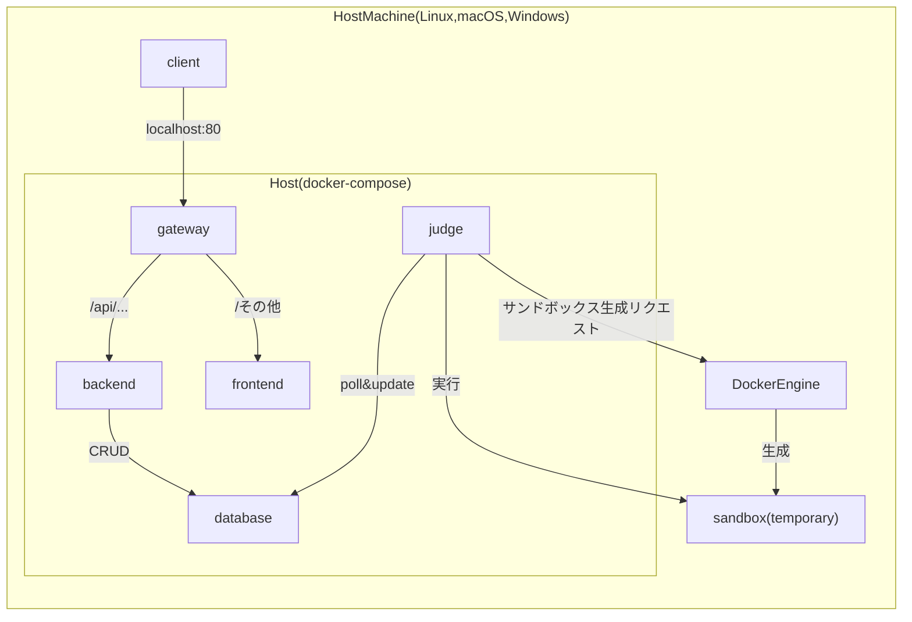

# 構成(ローカル)


* gateway: ゲートウェイサーバー(Nginx)。クライアントから来たリクエストのURLを読み、フロントとバックエンドに適切にフォワードする。また、ファイルのアップロードサイズの上限などを設けたり、その他フィルタリングも行う。
* frontend: フロントエンドサーバー(React)。WebUI(デプロイ時はHTML + Javascriptの静的コンテンツ)をクライアントに送る。
* backend: バックエンドサーバー(Echo)。バックエンドロジックを処理し、データベースにCRUD(Create,Read,Update,Delete)リクエストを送る。
* database: データベースサーバー(PostgreSQL)
* judge: ジャッジサーバー(Docker client)。DBを定期的にpollし、ジャッジリクエストが合ったらそれを処理する。DockerEngineにsandbox生成リクエストを送り、一時的なsandboxを生成してもらい、そのsandbox上でプログラムのコンパイル・実行を行う。

# はじめかた
1. リポジトリのクローン
    ```bash
    git clone https://github.com/dsa-uts/dsa-project.git
    ```

2. ディレクトリの移動
    ```bash
    cd dsa-project
    ```

3. Docker Engineのインストール
    [公式サイト](https://docs.docker.com/engine/install/)を参考にインストールする．
    終えたらバージョンを確認する．
    ```bash
    docker --version
    ```

4. コンテナイメージのビルド
    ```bash
    ./docker.py dev build
    ```

5. config設定
    ```bash
    cp config/dev/db_root_password.txt.example config/dev/db_root_password.txt # データベースのrootパスワード
    cp config/dev/db_app_password.txt.example config/dev/db_app_password.txt # アプリケーション用データベースのパスワード
    cp config/dev/admin.json.example config/dev/admin.json # 管理者アカウント情報
    ```
    必要に応じて、各ファイルの中身を編集する。

6. コンテナの起動
    ```bash
    ./docker.py dev
    ```

起動後、localhost:5173にアクセスすると、フロントエンドの画面が表示される。

# デプロイ時
1. frontendの[.env.production](./dsa-frontend/.env.production)を、実際のドメイン名に合わせて書き換える。
    ```env
    VITE_API_BASE_URL=https://your.domain.name/api
    ```
2. docker-compose.prod.yamlを編集し、外部からアクセスされるポート番号に合わせてnginxのポートbindingを変更する。
    ```yaml
    services:
      nginx:
        ports:
          - "0.0.0.0:80:80"  # ← ここの"0.0.0.0:XX:80"のXXを変更
    ```

3. docker.py prod buildを実行し、コンテナイメージをビルドする。

4. config設定
    ```bash
    cp config/db_root_password.txt.example config/db_root_password.txt
    cp config/db_app_password.txt.example config/db_app_password.txt
    cp config/admin.json.example config/admin.json
    ```
    必要に応じて、各ファイルの中身を編集する。

5. docker.py prodを実行し、コンテナを起動する。
