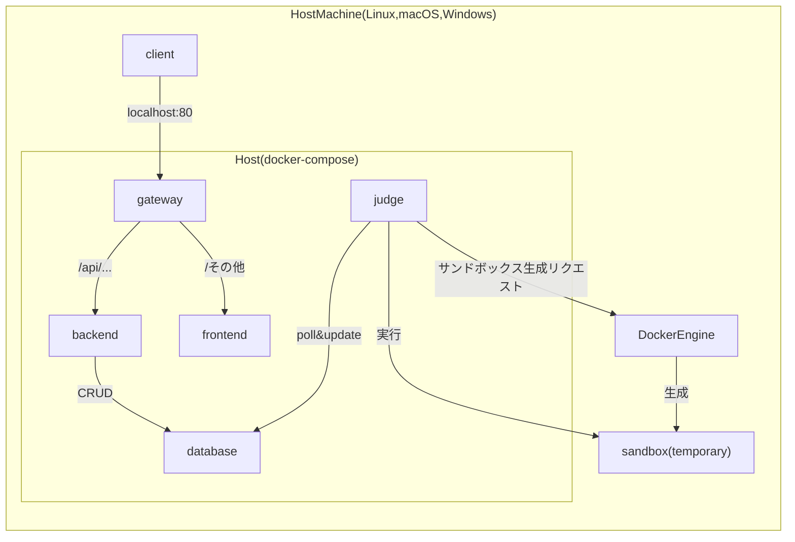

# 構成(ローカル)


* gateway: ゲートウェイサーバー(Nginx)。クライアントから来たリクエストのURLを読み、フロントとバックエンドに適切にフォワードする。また、ファイルのアップロードサイズの上限などを設けたり、その他フィルタリングも行う。
* frontend: フロントエンドサーバー(React)。WebUI(デプロイ時はHTML + Javascriptの静的コンテンツ)をクライアントに送る。
* backend: バックエンドサーバー(FastAPI)。バックエンドロジックを処理し、データベースにCRUD(Create,Read,Update,Delete)リクエストを送る。
* database: データベースサーバー(MySQL)
* judge: ジャッジサーバー(Docker client)。DBを定期的にpollし、ジャッジリクエストが合ったらそれを処理する。DockerEngineにsandbox生成リクエストを送り、一時的なsandboxを生成してもらい、そのsandbox上でプログラムのコンパイル・実行を行う。

# はじめかた
1. homebrewのインストール  
   [homebrewのページ](https://brew.sh/ja/)を開いてインストールコマンドをターミナルにコピペ&実行．  
   パス等の設定ができていない場合はそれも行う．

2. gitのインストール
   ```sh
   # インストール
   brew install git

   # パスを通す
   # zshrcの部分は設定が書いてあるファイル
   echo 'export PATH="/opt/homebrew/bin:$PATH"' >> ~/.zshrc

   # ターミナルを再起動するか以下で設定リロード
   source ~/.zshrc
   ```

3. 最新のdsa-projectとサブモジュールのクローン
   ```bash
   git clone --recurse-submodules https://github.com/dsa-uts/dsa-project
   ```
   もし既にクローンしている場合は
   ```bash
   git submodule update --init --recursive
   ```
   dsa-project自体のアップデートは
   ```bash
   git pull origin master #もしくは利用中のブランチ名
   ```

4. サブモジュールの環境設定  
   [dsa-backのREADME](https://github.com/dsa-uts/dsa-back/blob/main/README.md)

5. dockerの準備
   1. インストール  
        dockerの公式サイトからdocker desktop for macをインストールし，初期設定を行う．
      ```bash
      docker --version
      ```
        などのコマンドでインストールが完了していることを確認する．
   
   2. セットアップ
        サンドボックス用のコンテナ(`checker-lang-gcc`, `binary-runner`)をビルドし、`resource`ディレクトリ内のファイルのオーナーをゲストユーザーに変更する．
        ```bash
        ./setup.sh
        ```

   3. 起動  
        docker desktopを起動する．  
        その後，dsa-projectをクローンしたディレクトリへ移動し，
      ```bash
      docker-compose up --build
      ```
        を入力．

# コンテナへのアクセス
1. コンテナ名の確認
     ```bash
     docker ps
     ```
     NAMESの欄からアクセスしたいコンテナの名前を確認する．
2. アクセス
     ```bash
     docker exec -it [NAMES] bash
     ```
      
