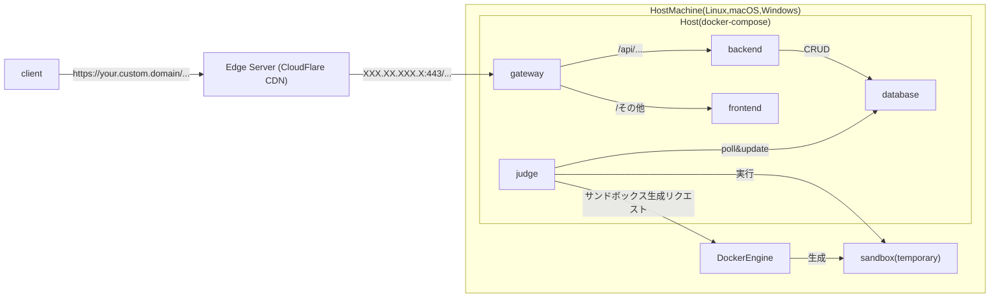
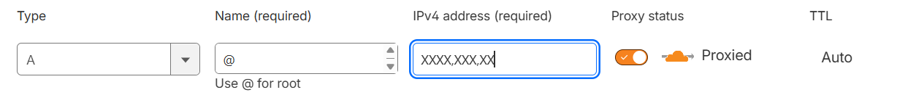
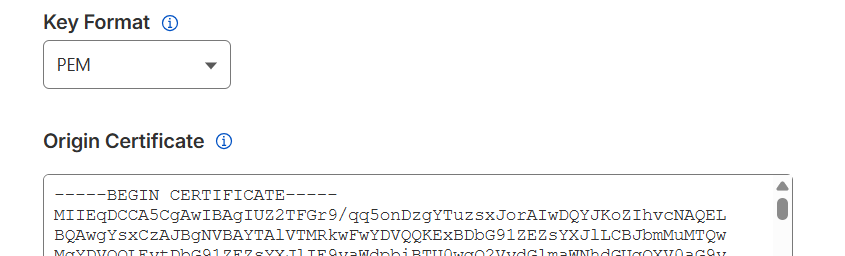

# CloudFlare CDN経由でのデプロイ方法
### 全体図


* CDN: CloudFlare CDNのエッジサーバー。クライアントから来たリクエストをgatewayにフォワードする。設定でDDOS攻撃対策やキャッシュ設定などができる。

他のコンポーネントは[トップページ](../README.md)の「構成(ローカル)」セクションを参照。

### 必要なもの
- CloudFlareアカウント
  - 無料プランで十分
- 自前で購入したドメイン (例: your.custom.domain)
  - CloudFlareで年間10ドル程度で購入可能
- サーバー (Linux, macOS, Windows)
  - Docker EngineとDocker Composeが動作すること
  - グローバルIPアドレスを持ち、443番ポートが外部からアクセス可能であること
  - 例: さくらインターネットのVPS、AWS EC2インスタンスなど
    - 自前のデスクトップPCでデプロイする場合は、ルーターのポートフォワーディング設定を行い、443番ポートをサーバーに転送する必要がある
      - それもできない場合は、CloudFlare Tunnel経由でデプロイする方法がある (準備中)

### 手順
1. CloudFlareアカウントを作成し、ドメインを登録する
    - CloudFlareでドメインを購入したら、自動で登録される。
    - 既存のドメインを使用する場合は、登録し、ネームサーバーをCloudFlareのものに変更する必要がある。やり方は指示されるのでそれに従う。
2. 登録したドメインのDNS設定を行う
    - CloudFlareのダッシュボードで、登録したドメインを選択し、「DNS」タブ → 「Records」セクションをクリックする。
    - 「Add record」をクリックし、以下のように設定する。
      - Type: A
      - Name: @ (もしくは希望のサブドメイン名、例: www)
      - IPv4 address: サーバーのグローバルIPアドレス (例: XXX.XX.XXX.X)
      - TTL: Auto
      - Proxy status: Proxied (オレンジの雲アイコン。これを有効にすることでCloudFlare CDN経由になり、グローバルIPアドレスが隠蔽される)

3. SSL/TLS設定を行う
    - CloudFlareのダッシュボードで、登録したドメインを選択し、「SSL/TLS」タブをクリックする。
      - 「Overview」セクションで、「Full (strict)」を選択する。
      - クライアントからCloudFlare CDNまでの通信と、CloudFlare CDNからサーバーまでの通信の両方が暗号化される。
      - ただし、CDNからサーバー間のhttps接続のために、サーバー側で有効なSSL証明書を設定する必要がある。
4. サーバー側のSSL証明書を作成する
    - CloudFlareの「SSL/TLS」タブで、「Origin Server」セクションをクリックする。
    - 「Create Certificate」をクリックし、以下のように設定する。
      - Generate private key and CSR with CloudFlare: 選択
        - Private key type: RSA (2048)
      - Hostnames: your.custom.domain (追加でsubdomain.your.custom.domainなども指定可能)
      - Certificate validity: 15 years
    - 「Create」をクリックすると、SSL証明書と秘密鍵が表示される。
      - 「Key Format」は「PEM」を選択する。
      - 「Certificate」の内容を`fullchain.pem`という名前のファイルに保存する。
      - 「Private Key」の内容を`privkey.pem`という名前のファイルに保存する。
      - **秘密鍵は再度表示できないので、必ず控えておくこと。**

5. サーバーにSSL証明書を配置する
    - dsa-projectリポジトリに`nginx/certs/`ディレクトリを作成し、先ほど保存した`fullchain.pem`と`privkey.pem`をその中に配置する。
    - 間違えてGitで追跡しないように、`.gitignore`ファイルに以下の行を追加しておく。
      ```
      nginx/certs/
      ```
    - [docker-compose.prod.yml](../docker-compose.prod.yml)で、gatewayサービスのボリュームマウント設定を以下のように編集する。
      ```yaml
      services:
        ...
        nginx:
          ports:
            # - "80:80"   # コメントアウトまたは削除
            - "443:443"   # 追加
          volumes:
            - ./nginx/nginx.conf:/etc/nginx/nginx.conf:ro
            - ./nginx/conf.d/:/etc/nginx/conf.d/:ro
            - ./nginx/log/:/var/log/nginx/:rw
            - ./nginx/certs/:/etc/nginx/certs/:ro  # 追加
      ```
    - [nginx/conf.d/default.conf](../nginx/conf.d/default.conf)で、SSL接続の設定を有効にするために、以下のように編集する。
      ```nginx
      server {
        listen 443 ssl;
        server_name dsa-jikken.com;
        http2 on;

        # Cloudflare Origin Certificate
        ssl_certificate /etc/nginx/certs/fullchain.pem;
        ssl_certificate_key /etc/nginx/certs/privkey.pem;

        # SSL settings
        ssl_protocols TLSv1.2 TLSv1.3;
        ssl_ciphers HIGH:!aNULL:!MD5;
        ssl_prefer_server_ciphers on;

        server_tokens off;

        location / {
          # proxy to frontend container
          proxy_pass http://frontend:80;
          proxy_set_header Host $host;
          proxy_set_header X-Real-IP $remote_addr;
        }

        location /api {
          # proxy to backend container
          proxy_pass http://backend:8000;
          proxy_set_header Host $host;
          proxy_set_header X-Real-IP $remote_addr;
        }

        # limit upload file size to 10MB
        client_max_body_size 10M;
      }
      ```

6. dsa-projectをサーバーにデプロイする
    - [dsa-backend/.env.production](../dsa-backend/.env.production)の`CORS_ALLOWED_ORIGINS`や、[dsa-frontend/.env.production](../dsa-frontend/.env.production)の`VITE_API_BASE_URL`などを、デプロイ先のドメイン名に合わせて編集する。
    - `./docker.py prod build`コマンドでプロダクション用イメージをビルドし、`./docker.py prod`コマンドでコンテナを起動する。